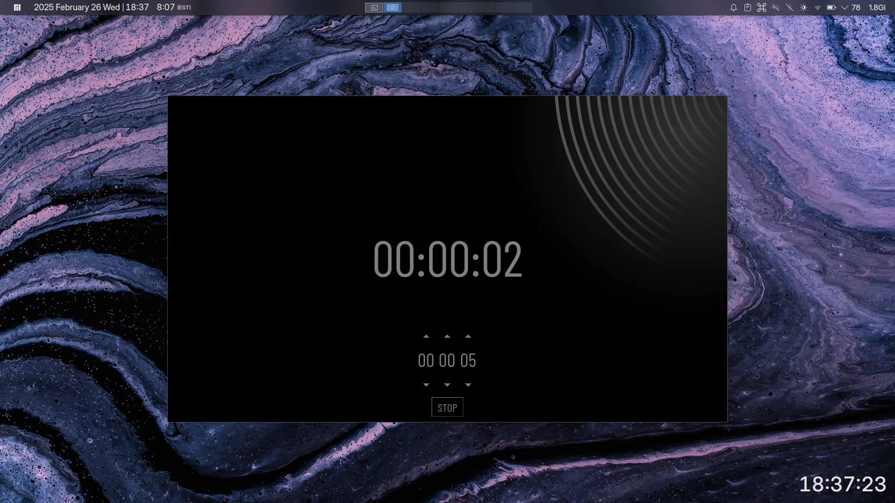

# tempo



a silly timer application made with python and tkinter.  
(there are some probs, but i'm not gonna fix it, i don't care)

## installation

```
git clone https://github.com/theoisdumb/tempo.git
cd tempo
./install.sh
```

## dependencies

- python
- tkinter
- [pillow](https://python-pillow.github.io/)
